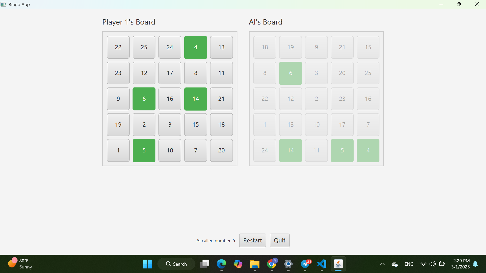

# Bingo Bash: Interactive Java Bingo Game

## Overview

Bingo Bash is a Java-based application that brings the classic game of Bingo to your desktop. This application offers a user-friendly and engaging experience, allowing players to enjoy Bingo in multiple game modes with visually appealing boards and intuitive controls. It has a responsive UI and navigation.

## Features

*   **Multiple Game Modes:**
    *   **AI Mode:** Play against a computer-controlled AI opponent.
    *   **Local Multiplayer (1 vs 1):** Challenge a friend to a local two-player match.
*   **Interactive Bingo Boards:**
    *   Two visually distinct boards, one for the player and one for the opponent.
    *   Clear and readable numbers on each board.
    *   Visually distinct marked cells using colors to easily track called numbers.
*   **Turn-Based Gameplay (1 vs 1 Mode):**
    *   Players take turns marking numbers on their respective boards.
    *   Clear indication of the current player's turn.
*   **User-Friendly Interface:**
    *   Intuitive and easy-to-understand controls.
    *   Visually appealing design with consistent styling.
*   **Clear Feedback:**
    *   Real-time updates display the numbers called and the current game state.
    *   Clear announcement of win/lose conditions at the end of the game.
*   **Smooth Scene Transitions:**
    *   Fade-in effects provide smoother transitions between the start, choice, and game screens.
*   **Game Navigation:**
    *   "Restart" and "Quit" buttons for easy navigation and game management.
    *   Post-game dialog with options to "Restart," "Go to Options," or "Quit."
*   **Customizable Window:**
    * The game screen can be resized while keeping the board at the center.
*   **Full-Screen Display:**
    *   The game launches in a full-screen mode, and all the windows are displayed in full screen.

## Screenshot

## Folder Structure

The project's folder structure is organized as follows:

BingoApp/
├── src/
│ └── ui/
│ ├── BoardView.java // Class for displaying and managing a single Bingo board
│ ├── BingoGUI.java // Main JavaFX class for the user interface
│ ├── ChoicePage.java // Class for the choice page
│ ├── ControlPanel.java // Class to manage the UI and interactions
│ ├── GameController.java // Class to manage the overall game flow
│ └── StartPage.java // Class for the start page
│ └── game/
│ ├── AIPlayer.java // Class for the AI player logic
│ ├── Board.java // Class for the Bingo board logic (5x5 grid)
│ ├── Game.java // Class for managing game flow
│ ├── NumberGenerator.java// Class for generating random numbers
│ └── Player.java // Class to represent a player (AI or human)
└── README.md // This file

*   **`src/ui/`:** Contains the JavaFX source code for the user interface.
*   **`src/game/`:** Contains the source code for the core game logic.

## Classes Explained

*   **`src/ui/BoardView.java`**:
    *   Displays and manages a single Bingo board.
    *   Handles UI components like buttons and grids.
    *   Is responsible for making each button clickable.
*   **`src/ui/BingoGUI.java`**:
    *   The main JavaFX application class.
    *   Handles the startup and manages scene transitions and the stage.
    *   This function manages full screen and handles the windows.
*   **`src/ui/ChoicePage.java`**:
    *   Allows the user to choose between playing against the AI or another player.
*   **`src/ui/ControlPanel.java`**:
    *   Acts as the main controller for the game screen.
    *   Manages the overall layout of the game and incorporates the boards.
    *   It calls the functions from gameController to handle the game logic.
*   **`src/ui/GameController.java`**:
    *   Manages the core game flow, turn management, and win condition checking.
*   **`src/ui/StartPage.java`**:
    *   Provides the entry point to the game with a title and a "Start Game" button.
*   **`src/game/AIPlayer.java`**:
    *   Implements the logic for the AI player, including making intelligent moves based on board analysis.
*   **`src/game/Board.java`**:
    *   Represents the Bingo board (5x5 grid) and handles marking numbers and checking for cleared lines.
*   **`src/game/Game.java`**:
    *   Manages the overall game flow.
    *   Checks for win conditions and calls `NumberGenerator.java` to generate numbers
*   **`src/game/NumberGenerator.java`**:
    *   Generates unique random numbers to fill the Bingo boards.
*   **`src/game/Player.java`**:
    *   Represents a player in the game.

## How to Run the Game

1.  **Prerequisites:**
    *   Java Development Kit (JDK) installed (version 11 or higher).
    *   A suitable Integrated Development Environment (IDE) such as IntelliJ IDEA, Eclipse, or NetBeans.
2.  **Clone the Repository:** Clone the project's repository to your local machine.
3.  **Open the Project in IDE:** Open the project in your preferred IDE.
4.  **Add JavaFX libraries:** This might be automatically done with some IDEs. If not, make sure that you include the appropriate libraries in the dependencies.
5.  **Build the Project:** Build the project to compile the Java source code.
6.  **Run the Application:** Run the `BingoGUI.java` file (it contains the `main` method) to start the Bingo game.

## Contributing

Contributions to enhance Bingo Bash are welcome! If you find a bug or have an idea for a new feature, please open an issue or submit a pull request.

## Acknowledgments

*   This project was inspired by the classic game of Bingo.
*   Thanks to the JavaFX community for providing a powerful framework for building desktop applications.

---

Enjoy playing Bingo Bash!
